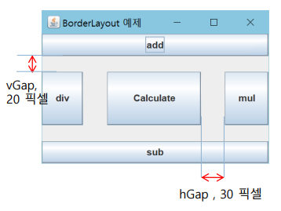

# 이승엽 202030121

## 5월 17일
### 컨테이너의 배치관리자
  * 컨테이너마다 하나의 배치관리자 존재  
  * 컨테이너에 부착되는 컴포넌트의 위치와 크기 결정  
  * 컨테이너의 크기가 변경되면, 컴포넌트의 위치와 크기 재결정  
### 배치 관리자 대표 유형 4가지  
  * FlowLayout 배치관리자  
    -컴포넌트가 삽입되는 순서대로 왼쪽에서 오른쪽으로 배치  
    -배치할 공간이 없으면 아래로 내려와서 반복한다.  
  * BorderLayout 배치관리자  
    -컨테이너의 공간을 동 서 남 북 중앙 5개의 영역으로 나눔  
    -5개 영역 중 응용프로그램에서 지정한 영역에 컴포넌트 배치  
  * GridLayout 배치관리자  
    -컨테이너를 프로그램에서 설정한 동일한 크기의 2차원 격자로 나눔  
    -컴포넌트는 삽입 순서대로 좌에서 우로, 다시 위에서 아래로 배치  
  * CardLayout 배치관리자  
    -컨테이너의 공간에 카드를 쌓아 놓은 듯이 컴포넌트를 포개어 배치
            
### 컨테이너의 디폴트 배치 관리자
  
### setLayout 메소드 호출  
  * lm을 새로운 배치관리자로 설정
### FlowLayout 배치관리자
  * 배치방법 : 컴포넌트를 컨테이너 내에 왼쪽에서 오른쪽으로 배치  
    -다시 위에서 아래로 순서대로 배치  
      ```java
      container.setLayout(new FlowLayout());  
      container.add(new JButton("add"));  
      container.add(new JButton("sub"));  
      container.add(new JButton("mul"));  
      container.add(new JButton("div"));
      container.add(new JButton("Calculate"));
      ```
### FlowLayout의 생성자
  * FlowLayout()  
  * FlowLayout(int align, int hGap, int vGap)  
    -align : 컴포넌트를 정렬하는 방법 지정. 왼쪽 정렬(FlowLayout.LEFT), 오른
쪽 정렬(FlowLayout.RIGHT), 중앙 정렬(FlowLayout.CENTER(디폴트))  
    -hGap : 좌우 두 컴포넌트 사이의 수평 간격, 픽셀 단위. 디폴트는 5  
    -vGap : 상하 두 컴포넌트 사이의 수직 간격, 픽셀 단위. 디폴트는 5  
      
### BorderLayout 배치관리자
  * 컨테이너 공간을 5구역으로 분할, 배치  
    -동, 서, 남, 북, 중앙  
  * 배치 방법  
    -add<Component comp, int index>  
    ```java
    container.setLayout(new BorderLayout());
    container.add(new JButton("div"), BorderLayout.WEST);
    container.add(new JButton("Calculate"), BorderLayout.CENTER);
    ```  
      

## 5월 3일 GUI
1. GUI 응용프로그램
  * GUI  
    -사용자가 편리하게 입출력 할 수 있도록 그래픽으로 화면을 구성하고, 마우스나 키보드로 입력받을 수 있도록 지원하는 사용자 인터페이스  
2. AWT와 Swing 패키지
  * AWT 패키지  
    -AWT 컴포넌트는 중량 컴포넌트  
  * Swing 패키지  
    -AWT 기술을 기반으로 작성된 자바 라이브러리  
    -모든 AWT기능 + 추가된 풍부하고 화려한 고급 컴포넌트  
    -순수 자바 언어로 구현  
    -Swing 컴포넌트는 경량 컴포넌트  
    -현재 자바의 GUI로 사용됨  
3. 컨테이너
  * 다른 컴포넌트를 포함할 수 있는 GUI 컴포넌트  
    -java.awt.Container를 상속받음  
  * 다른 컨테이너에 포함될 수 있음  
4. 컴포넌트
  * 컨테이너에 포함되어야 화면에 출력될 수 있는 GUI 객체  
  * 다른 컴포넌트를 포함할 수 없는 순수 컴포넌트  
  * 모든 GUI 컴포넌트가 상속받는 캘래스 : java.awt.Component  
  * 스윙 컴포넌트가 상속받는 클래스 : javax.swing.JComponent  
5. 최상위 컨테이너
  * 다른 컨테이너에 포함되지 않고도 화면에 출력되며 독립적으로 존재 가능한 컨테이너  
    -스스로 화면에 자신을 출력하는 컨테이너 : JFrame, JDialog, JApplet  
6. 스윙 GUI 프로그램 만들기
  * 스윙 GUI 프로그램을 만드는 과정  
    1.스윙 프레임 작성  
    2.main() 메소드 작성  
    3.스윙 프레임에 스윙 컴포넌트 붙이기  
  * 스윙 프로그램 작성에 필요한 import문  
    -import.java.awt.*;  
    -import.java.awt.event.*;  
    -import.java.awt.swing.*;  
    -import.java.awt.swing.event.*;  
7. 스윙 프레임
  * 모든 스윙 컴포넌트를 담는 최상위 컨테이너  
  * JFrame을 상속받아 구현  
  * 컴포넌트들은 화면에 보이려면 스윙 프레임에 부착되어야 함  
    -프레임을 닫으면 프레임에 부착된 컴포넌트가 보이지 않게 됨  
8. 스윙 프레임(JFrame) 기본 구성 
  * 프레임 - 스윙 프로그램의 기본 틀  
  * 메뉴바 - 메뉴들이 부착되는 공간  
  * 컨텐트팬 - GUI 컴포넌트들이 부착되는 공간  
9. 스윙 프레임 만들기
  * JFrame 클래스를 상속받은 클래스 작성  
  * 프레임의 크기 반드시 지정 : setSize() 호출  
  * 프레임을 화면에 출력하는 코드 반드시 필요 : setVisble(true) 호출  
10. 스윙 응용프로그램에서 main()의 기능 최소화 바람직
  * 스윙 응용프로그램이 실행되는 시작점으로서의 기능만  
  * 스윙 프레임을 생성하는 정동의 코드로 최소화
11. 스윙 응용프로그램 내에서 스스로 종료하는 방법  
  * Ststem.exit(0);  
    -언제 어디서나 무조건 종료  
12. 프레임의 오른쪽 상단의 종료버튼(x)이 클릭되면 어떤 일이 일어나는가?  
  * 프레임 종료, 프레임 윈도우를 닫음  
    -프레임이 화면에서 보이지 않게 됨  
  * 프레임이 보이지 않게 되지만 응용프로그램이 종료한 것이 아님  
    -키보드나 마우스 입력을 받지 못함  
    -다시 setVisble(true)를 호출하면, 보이게 되고 이전 처럼 작동함  
13. 프레임 종료버튼이 클릭될 때, 프레임과 함께 프로그램을 종료시키는 방법
  * frame.setDefaultCloseOperation(JFrame.EXIT_ON_CLOSE);  

## 5월 3일 컬렉션의 개념
1. 컬렉션
  * 요소(elelment)라고 불리는 가변 개수의 객체들의 저장소  
    -객체들의 컨테이너라고도 불림  
    -요소의 개수에 따라 크기 자동 조절  
    -요소의 삽입, 삭제에 따른 요소의 위치 자동 이동  
  * 고정 크기의 배열을 다루는 어려움 해소  
  * 다양한 객체들의 삽입, 삭제, 검색 등의 관리 용이  
2. 제네릭 
  * 특정 타입만 다루지 않고, 여러 종류의 타입으로 변신할 수 있도록 클래스나 메소드를 일반화 시키는 기법  
  * 클래스나 인터페이스 이름에 <E>, <K>, <V> 등 타입매개변수 포함  
3. 컬렉셔의 요소는 객체만 가능
  * int, char, double 등의 기본 타입으로 구체화 불가  
4. 제네릭은 형판과 같은 개념
  * 클래스나 메소드를 형판에서 찍어내듯이 생산할 수 있도록 일반화된 형판을 만드는 기법  
5. 제네릭의 기본 개념
  * JDK 1.5부터 도입  
  * 모든 종류의 데이터 타입을 다룰 수 있도록 일반화된 타입 매개 변수로 클래스나 메소드를 작성하는 기법  
  * C++의 템플릿과 동일  
6. 백터 Vector<E>의 특성  
  * <E>의 사용할 요소의 특정 타입으로 구체화  
  * 배열을 가변 크기로 다룰 수 있게 하는 컨테이너  
    -배열의 길이 제한 극복  
    -요소의 개수가 넘치면 자동으로 길이 조절  
  * 요소 객체들을 삽입, 삭제, 검색하는 컨테이너  
    -삽입, 삭제에 따라 자동으로 요소의 위치 조정  
  * Vector에 삽입 가능한 것  
    -객체, NULL  
    -기본 타입의 값은 Wrapper 객체로 만들어 저장  
  * Vector에 객체 삽입  
    -벡터의 맨 뒤, 중간에 객체 삽입 가능  
  * Vector에서 객체 삭제  
    -임의의 위치에 있는 객체 삭제 가능  
7. 컬렉션과 자동 박싱/언박싱
  * JDK 1.5 이전  
    -기본 타입 데이터를 Wrapper 객체로 만들어 삽입  
    -컬렉션으로부터 요소를 얻어올 때, Wrapper 클래스로 캐스팅 필요  
  * JDK 1.5 이후  
    -자동 박싱/언박싱이 작동하여 기본 타입 값 삽입 가능  
8. ArrayList<E>
  * 가변 크기 배열을 구현한 클래스  
    -<E>에 요소로 사용할 특정 타입으로 구체화  
  * 벡터와 거의 동일  
    -벡터 기능과 거의 동일  
    -벡터와 달리 스레드 동기화 기능이 없음  
9. 컬렉션의 순차 검색을 위한 Iterator
  * Iterator<E> 인터페이스  
    -리스트 구조의 컬렉션에서 요소의 순차 검색을 위한 인터페이스  
10. HashMap<K, V>
  * 키(key)와 값(value)의 쌍으로 구성되는 요소를 다루는 컬렉션  
    -K : 키로 사용할 요소의 타입  
    -V : 값으로 사용할 요소의 타입  
    -키와 값이 한 쌍으로 삽입  
    -'값'을 검색하기 위해서는 반드시 '키' 이용  
  * 삽입 및 검색이 빠른 특징  
    -요소 삽입 : put() 메소드  
    -요소 검색 : get() 메소드  
11. 제네릭 클래스 작성  
  * 클래스 이름 옆에 일반화된 타입 매개 변수 추가  
  * 제네릭 객체 생성 및 활용  
    -제네릭 타입에 구체적인 타입을 지정하여 객체를 생성하는 것을 구체화 라고 함  

## 4월 19일 모듈과 패키지 개념
1. 패키지 개념과 필요성
  * 합칠 때 오류 발생 가능성  
    -개발자가 서로 다른 디렉터리로 코드 관리하여 해결
2. 패키지
  * 서로 관련된 클래스와 인터페이스를 컴파일한 클래스 파일들을 묶어 놓은 디렉터리  
  * 하나의 응용프로그램은 한 개 이상의 패키지로 작성  
  * 패키지는 jar파일로 압축할 수 있음  
3. 모듈
  * 여러 패키지와 이미지 등의 자원을 모아 놓은 컨테이너  
  * 하나의 모듈을 하나의 .jmod 파일에 저장  
4. Java 9부터 모듈화 도입
  * 플랫폼의 모듈화  
    -Java 9부터 자바 API의 모든 클래스들(자바 실행 환경)을 패키지 기반에서 모듈들로 완전히 재구성  
  * 응용프로그램의 모듈화  
    -클래스들은 패키지로 만들고, 다시 패키지를 모듈로 만듬  
5. 모듈화의 목적
  * Java 9부터 자바 API를 여러 모듈(99개)로 분할  
    -Java 8까지는 rt.jar의 한 파일에 모든 API 저장  
  * 응용프로그램이 실행할 때 꼭 필요한 모듈들로만 실행 환경 구축  
    -메모리 자원이 열악한 작은 소형 기기에 꼭 필요한 모듈로 구성된 작은 크기의 실행 이미지를 만들기 위함  
6. 모듈의 현실  
  * Java 9부터 전면적으로 도입  
  * 복잡한 개념  
  * 큰 자바 응용프로그램에는 개발, 유지보수 등에 적합  
7. 자바 JDK에 제공되는 모듈 파일들
  * 자바가 설치된 jmods 디렉터리에 모듈 파일 존재  
    -.jmod 확장자를 가진 파일  
    -모듈 파일은 ZIP 포맷으로 압축된 파일  
  * 모듈 파일에는 자바 API의 패키지와 클래스들이 들어 있음  
8. 클래스 파일이 저장되는 위치
  * 클래스나 인터페이스가 컴파일되면 클래스 파일 생성  
  * 클래스 파일은 패키지로 선언된 디렉터리에 저장  
9. 패키지 선언  
  * 소스 파일의 맨 앞에 컴파일 후 저장될 패키지 지정  
10. package 선언문이 없는 자바 소스 파일의 경우  
  * 컴파일러는 클래스나 인터페이스를 디폴트 패키지에 소속시킴  
  * 디폴트 패키지  
    -현재 디렉터리  
11. 모듈
  * Java 9에서 도입된 개념  
  * 패키지와 이미지 등의 리소스를 담은 컨테이너  
  * 모듈 파일(.jmod)로 저장  
12. 자바 실행 환경
  * JRE : 디폴트 자바 실행 환경  
    -자바 모듈(컴파일된 자바 API 클래스들), 자바 가상 기계 등으로 구성
13. 자바 모듈화의 목적 
  * 자바 컴포넌트들을 필요에 따라 조립하여 사용하기 위함  
  * 컴퓨터 시스템의 불필요한 부담 감소  
    -세밀한 모듈화를 통해 필요 없는 모듈이 로드되지 않게 함  
    -소형 IoT 장치에도 자바 응용프로그램이 실행되고 성능을 유지하게 함  
14. Object 클래스 특징
  * 모든 자바 클래스는 반드시 Object를 상속받도록 자동 컴파일  
    -모든 클래스의 수퍼 클래스  
    -모든 클래스가 상속받는 공통 메소드 포함  
15. Object 클래스는 객체의 속성을 나타내는 메소드 제공
  * hashCode() 메소드  
    -객체의 해시코드 값을 리턴하며, 객체마다 다름  
  * getClass() 메소드  
    -객체의 클래스 정보를 담은 Class 객체 리턴  
    -Class 객체의 getName() 메소드는 객체의 클래스 이름 리턴  
  * toString() 메소드  
    - 객체를 문자열로 리턴  

## 4월 19일
1. 메소드 오버라이딩
  * 서브 클래스에서 슈퍼 클래스의 메소드 중복 작성  
  * 슈퍼 클래스의 메소드 무력화, 항상 서브 클래스에 오버라이딩당한 메소드가 실행되도록 보장됨  
  * "메소드 무시하기"로 번역되기도 함  
2. 오버라이딩 조건
  * 슈퍼 클래스 메소드의 원형(메소드 이름, 인자 타입 및 개수, 리턴 타입) 동일하게 작성  
3. 오버라이딩으로 다형성 실현
  * 하나의 인터페이스(같은 이름)에 서로 다른 구현  
  * 슈퍼 클래스의 메소드를 서브 클래스에서 각각 목적에 맞게 다르게 구현  
  * 사례  
    -Shape의 draw() 메소드를 Line, Rect, Circle에서 오버라이딩하여 다르게 구현  
4. 추상 메소드 --------------------------------------
  * abstract로 선언된 메소드, 메소드의 코드는 없고 원형만 선언  
5. 추상 클래스(교재참고)
  * 추상 메소드를 가지며, abstract로 선언된 클래스  
  * 추상 메소드 없이, abstract로 선언한 클래스
6. 추상 클래스 상속 
  * 추상 클래스를 상속받으면 추상 클래스가 됨  
  * 서브 클래스도 abstract로 선언해야 함  
7. 추상 클래스 구현
  * 서브 클래스에서 슈퍼 클래스의 추상 메소드 구현(오버라이딩)  
  * 추상 클래스를 구현한 서브 클래스는 추상 클래스 아님  
8. 추상 클래스의 목적  
  * 상속을 위한 슈퍼 클래스로 활용하는 것  
  * 서브 클래스에서 추상 메소드 구현  
  * 다형성 실현
9. 자바의 인터페이스
  * 클래스가 구현해야 할 메소드들이 선언되는 추상형  
  * 인터페이스 선언  
    -interface 키워드로 선언  
    -Ex) public interface SerialDriver {...}  
10. 자바 인터페이스에 대한 변화  
  * java 7까지  
    -인터페이스는 상수와 추상 메소드로만 구성  
  * java 8부터  
    -상수와 추상 메소드 포함  
    -default 메소드 포함 (Java 8)  
    -private 메소드 포함 (Java 9)  
    -static 메소드 포함 (Java 9)  
  * 여전히 인터페이스에는 필드(멤버 변수) 선언 불가
11. 인터페이스 간에 상속 가능
  * 인터페이스를 상속하여 확장된 인터페이스 작성 가능  
  * extends 키워드로 상속 선언

## 4월 12일 상속
1. 객체 지향 상속
  * 자식이 부모 유전자를 물려 받는 것과 유사한 개념  
2. 상속 선언
  * extends 키워드로 선언  
    -부모 클래스를 물려받아 확장한다는 의미  
  * 부모 클래스 -> 슈퍼 클래스(super class)  
  * 자식 클래스 -> 서브 클래스(sub class)  
3. 서브 클래스 객체의 모양
  * 슈퍼 클래스 객체와 서브 클래스의 객체는 별개  
  * 서브 클래스 객체는 슈퍼 클래스 멤버 포함   
4. 자바 상속의 특징
  * 클래스 다충 상속 불허  
    -C++는 다중 상속 가능 (다중 상속으로 멤버가 중복 생성되는 문제 있음)  
    -자바는 인터페이스의 다중 상속 허용  
  * 모든 자바 클래스는 묵시적으로 Object클래스 상속받음  
    -java.lang.Object는 클래스는 모든 클래스의 슈퍼 클래스  
5. 슈퍼 클래스의 멤버에 대한 서브 클래스의 접근
  * 슈퍼 클래스의 private 멤버  
    -서브 클래스에서 접근할 수 없음  
  * 슈퍼 클래스의 디폴트 멤버  
    -서브 클래스가 동일한 패키지에 있을 때, 접근 가능  
  * 슈퍼 클래스의 public 멤버  
    -서브 클래스는 항상 접근 가능  
  * 슈퍼 클래스의 protected 멤버  
    -같은 패키지 내의 모든 클래스 접근 허용  
    -패키지 여부와 상관없이 서브 클래스는 접근 가능  
6. protected 멤버
  * protected 멤버에 대한 접근  
    -같은 패키지의 모든 클래스에게 허용  
    -상속되는 서브 클래스(같은 패키지든 다른 패키지든 상관없음)에게 허용  
7. 서브 클래스의 객체가 생성될 때
  * 슈퍼 클래스 생성자와 서브 클래스 생성자 모두 실행  
  * 호출 순서  
    -서브 클래스의 생성자 먼저 호출  
    -서브 클래스의 생성자는 실행 전 슈퍼 클래스 생성자 호출  
  * 실행 순서  
    -슈퍼 클래스의 생성자가 먼저 실행된 후 서브 클래스의 생성자 실행
8. 서브 클래스와 슈퍼 클래스의 생성자 선택
  * 슈퍼 클래스와 서브 클래스  
    -각각 여러 개의 생성자 작성 가능  
  * 서브 클래스의 객체가 생성될 때  
    -슈퍼 클래스 생성자 1개와 서브 클래스 생성자 1개가 실행  
9. super()
  * 서브 클래스에서 명시적으로 슈퍼 클래스의 생성자 선택 호출  
  * 사용 방식  
    -super(parameter);  
    -인자를 이용하여 슈퍼 클래스의 적당한 생성자 호출  
    -반드시 서브 클래스 생성자 코드의 제일 첫 라인에 와야 함  
10. 업캐스팅
  * 슈퍼 클래스의 레퍼런스를 슈퍼 클래스 레퍼런스에 대입  
  * 슈퍼 클래스 레퍼런스로 서브 클래스 객체를 가리키게 되는 현상 
11. 다운캐스팅  
  * 슈퍼 클래스 레퍼런스를 서브 클래스 레퍼런스에 대입  
  * 업캐스팅 된 것을 다시 원래대로 되돌리는 것  
  * 반드시 명시적 타입 변환 지정           


## 4월 12일
1. 자바의 접근 지정자
  * 4가지  
    -private, protected, public, 디폴트(접근지정자 생략) 
2. 접근 지정자의 목적
  * 클래스나 일부 멤버를 공개하여 다른 클래스에서 접근하도록 허용  
  * 객체 지향 언어의 캡슐화 정책은 멤버를 보호하는 것  
    -접근 지정은 캡슐화에 묶인 보호를 일부 해제할 목적
3. 접근 지정자에 따른 클래스나 멤버의 공개 범위
  * (public (protected (디폴트 (private) ) ) )  
    -public : 모든 클래스에 허용  
    -protected : 동일 패키지와 자식 클래스에 허용  
    -디폴트 : 동일 패키지에 허용  
    -private : 외부로부터 완벽 차단  
4. 클래스 접근지정
  * 다른 클래스에서 사용하도록 허용할 지 지정  
  * public 클래스  
    -다른 모든 클래스에게 접근 허용  
  * 디폴트 클래스(접근지정자 생략)  
    -package-private라고도 함  
    -같은 패키지의 클래스에만 접근 허용
5. 멤버 접근 지정
  * public 멤버  
    -패키지에 관계 없이 모든 클래스에게 접근 허용  
  * private 멤버  
    -동일 클래스 내에만 접근 허용  
    -상속 받은 서브 클래스에서 접근 불가  
  * protected 멤버  
    -같은 패키지 내의 다른 모든 클래스에게 접근 허용  
    -상속 받은 서브 클래스는 다른 패키지에 있어도 접근 가능  
  * 디폴트 멤버  
    -같은 패키지 내의 다른 클래스에게 접근 허용  
6. static의 활용
  * 전역 변수와 전역 함수를 만들 때 활용  
  * 공유 멤버를 만들고자 할 때  
    -static으로 선언한 멤버는 클래스의 객체들 사이에 공유  
  * static 메소드는 오직 static 멤버만 접근 가능  
    -객체가 생성되지 않은 상황에서도 static 메소드는 실행될 수 있기 때문에, non-static 멤버 활용 불가  
    -non-static 메소드는 static 멤버 사용 가능  
  * static 메소드는 this 사용불가  
    -static 메소드는 객체 없이도 사용 가능하므로, this 레퍼런스 사용할 수 없음  
7. final 클래스와 메소드
  * final 클래스  
    -더 이상 클래스 상속 불가능  
  * final 메소드  
    -더 이상 오버라이딩 불가능      
8. final 필드
  * 상수를 선언할 때 사용  
  * 상수 필드는 선언 시에 초기 값을 지정하여야 한다  
  * 상수 필드는 실행 중에 값을 변경할 수 없다  


## 4월 5일 객체

1. 객체
  * 실세계 객체의 특징  
    -객체마다 고유한 특성과 행동을 가짐  
    -다른 객체들과 정보를 주고 받는 등, 상호작용하면서 살아감  
  * 컴퓨터 프로그램에서 객체 사례  
    -테트리스 게임의 각 블록들  
    -한글 프로그램의 메뉴나 버튼들  
2. 객체 지향 특성 : 캡슐화
  * 캡슐화 : 객체를 캡슐로 싸서 내부를 볼 수 없게 하는 것  
    -객체의 가장 본질적인 특징  
    (외부의 접근으로부터 객체)  
  * 자바의 캡슐화  
    -클래스 : 객체 모양을 선언한 틀(캡슐화하는 틀)  
    -객체 : 생성된 실체  
3. 객체 지향 특성 : 상속  
  * 상속  
    -상위 개체의 속성이 하위 개체에 물려짐  
    -하위 개체가 상위 개체의 속성을 모두 가지는 관계  
4. 자바 상속  
  * 상위 클래스의 멤버를 하위 클래스가 물려받음    
    -상위 클래스 : 수퍼 클래스  
    -하위 클래스 : 서브 클래스, 수퍼 클래스 코드의 재사용, 새로운 특성 추가 가능  
5. 객체 지향 특성 : 다향성
  * 같은 이름의 메소드가 클래스 혹은 객체에 따라 다르게 구현되는 것  
  * 다형성 사례  
    -메소드 오버로딩 : 한 클래스 내에서 같은 이름이지만 다르게 작동하는 여러 메소드  
    -메소드 오버라이딩 : 수퍼 클래스의 메소드를 동일한 이름으로 서브 클래스마다 다르게 구현  
6. 객체 지향 언어의 목적
  * 1 소프트웨어의 생산성 향상  
    * 컴퓨터 산업 발전에 따라 소프트웨어의 생명 주기 단축         
      -소프트웨어를 빠른 속도로 생산할 필요성 증대  
    * 객체 지향 언어  
      -상속, 다형성, 객체, 캡슐화 등 소프트웨어 재사용을 위한 여러 장치 내장  
      -소프트웨어를 다시 만드는 부담 대폭 줄임  
      -소프트웨어 생산성 향상  

  *  2 실세계에 대한 쉬운 모델링  
    * 초기 프로그래밍     
      -수학 게산/통게 처리를 하는 등 처리 과정, 계산 절차 중요
    * 현대 프로그래밍  
      -컴퓨터가 산업 전반에 활용  
      -실세계에서 발생하는 일을 프로그래밍  
      -실세계에서는 절차나 과정보다 객체들의 상호작용으로 묘사하는 것이 용이  
    * 객체 지향 언어  
      -실세계의 일을 보다 쉽게 프로그래밍하기 위한 객체 중심적 언어 
7. 절차 지향 프로그래밍과 객체 지향 프로그래밍  
  * 절차 지향 프로그래밍  
    -작업 순서를 표현하는 컴퓨터 명령 집합  
    -함수들의 집합으로 프로그램 작성  
  * 객체 지향 프로그래밍  
    -컴퓨터가 수행하는 작업을 객체들간의 상호작용으로 표현  
    -클래스 혹은 객체들의 집합으로 프로그램 작성      
8. 클래스와 객체
  * 클래스  
    -객체의 속성과 행위 선언  
    -객체의 설계도 혹은 틀  
  * 객체  
    -클래스의 틀로 찍어낸 실체  
    (프로그램 실행 중에 생성되는 실체, 메모리 공간을 갖는 구체적인 실체)  
9. 자바 클래스 구성
  * 클래스  
    -class 키워드로 구성 요소
    -멤버 : 클래스 구성 요소  
    (필드(멤버 변수) 와 메소드(멤버 함수))  
    -클래스에 대한 public 접근 지정 : 다른 모든 클래스에서 클래스 사용 허락  
    -멤버에 대한 public 접근 지정 : 다른 모든 클래스에게 멤버 접근 허용  
10. 생성자 개념과 목적
  * 생성자  
    -객체가 생성될 때 초기화 목적으로 실행되는 메소드  
    -객체가 생성되는 순간에 자동 호출  
11. 생성자의 특징
  * 생성자 이름은 클래스 이름과 동일  
  * 생성자는 여러 개 작성 가능(생성자 중복)  
    ```
    public class Circle {  
      public Circle() {...} // 매개 변수 없는 생성자
      public Circle(int r, String n) {...} // 2개의 매개 변수를 가진 생성자
    }
    ```
  * 생성자는 객체 생성시 한 번만 호출  
    -자바에서 객체 생성은 반드시 new 연산자로 함  
    ```
    Circle pizza = new Circle(10, "자바피자"); // 생성자 Circle(int r, String n) 호출
    Circle donut = new Circle(); // 생성자 Circle() 호출
    ```
  * 생성자의 목적은 객체 생성 시 초기화  
  * 생성자는 리턴 타입을 지정할 수 없음      
12. 기본 생성자
  * 매개 변수 없고, 아무 작업 없이 단순 리턴하는 생성자  
  ```
  class Circle {
    public Circle() {} // 기본 생성자
  }
  ```  
  * 디폴트 생성자라고도 불림  
13. 기본 생성자가 자동 생성되는 경우
  * 클래스에 생성자가 하나도 선언되어 있지 않을 때  
    -컴파일러에 의해 기본 생성자 자동 생성  
14. 기본 생성자가 자동 생성되지 않는 경우
  * 클래스에 생성자가 선언되어 있는 경우  
    -컴파일러는 기본 생성자를 자동 생성해 주지 않는다.  
15. this 레퍼런스          
  * 객체 자신에 대한 레퍼런스 
    -컴파일러에 의해 자동 관리, 개발자는 사용하기만 하면 됨 
    -this.멤버 형태로 멤버를 접근할 때 사용 
16. this()로 다른 생성자 호출
  * 같은 클래스의 다른 생성자 호출  
  * 생성자 내에서만 사용 가능 
  * 생성자 코드의 제일 처음에 있어야 함 
    -this() 사용 실패 사례  
    ```
    public Book {
      System.out.println("생성자 호출됨");
      this("", "", 0); // 생성자의 첫 번째 문장이 아니기 때문에 컴파일 오류
    }
    ```    
17. 객체 배열
  * 자바의 객체 배열  
    -객체에 대한 레퍼런스 배열임  
  * 자바의 객체 배열 만들기 3단계 
    -1 배열 레퍼런스 변수 선언  
    -2 래퍼런스 배열 생성 
    -3 배열의 각 원소 객체 생성 
18. 메소드
  * 메소드는 c / c++ 의 함수와 동일 
  * 자바의 모든 메소드는 반드시 클래스 안에 있어야 함(캡슐화 원칙)  
19. 메소드 형식
  * 접근 지정자 
    -다른 클래스에서 메소드를 접근할 수 있는지 여부 선언  
    -public, private, protected, 디폴트(접근 지정자 생략)   
  * 리턴 타입  
    -메소드가 리턴하는 값의 데이터 타입  
20. 인자 전달 - 기본 타입의 값이 전달되는 경우
  * 매개 변수가 byte. int. double 등 기본 타입으로 선언되었을 때  
    -호출자가 건네는 값이 매개 변수에 복사되어 전달(실인자 값은 변경되지 않음)  
21. 인자 전달 - 객체가 전달되는 경우
  * 객체의 레퍼런스만 전달  
    -매개 변수가 실인자 객체 공유  
22. 인자 전달 - 배열이 전달되는 경우
  * 배열 레퍼런스만 매개 변수에 전달  
    -배열 통째로 전달되지 않음  
  * 객체가 전달되는 경우와 동일  
    -매개 변수가 실인자의 배열 공유      
23. 메소드 오버로딩    
  * 한 클래스 내에서 두 개 이상의 이름이 같은 메소드 작성  
    -메소드 이름이 동일하여야 함  
    -매개 변수의 개수가 서로 다르거나, 타입이 서로 달라야 함  
    -리턴 타입은 오버로딩과 관련 없음  
24. 객체 소멸
  * new에 의해 할당 받은 객체와 배열 메모리를 자바 가상 기계로 되돌려 주는 행위  
  * 소멸된 객체 공간은 가용 메모리에 포함  
25. 자바에서 사용자 임의로 객체 소멸안됨
  * 자바는 객체 소멸 연산자 없음  
    -객체 생성 연산자 : new  
  * 객체 소멸은 자바 가상 기계의 고유한 역할  
  * 자바 개발자에게는 매우 다행스러운 기능  
    -C / C++에서는 할당 받은 객체를 개발자가 프로그램 내에서 삭제해야 함  
    -C / C++의 프로그램 작성을 어렵게 만드는 요인  
    -자바에서는 사용하지 않는 객체나 배열을 돌려주는 코딩 책임으로부터 개발자 해방
26. 가비지
  * 가리키는 레퍼런스가 하나도 없는 객체  
    -더 이상 접근할 수 없어  사용할 수 없게 된 메모리  
27. 가비지 컬렉션
  * 자바 가상 기계의 가비지 컬렉터가 자동으로 가비지 수집, 반환
  * 자바 가상 기계가 가비지 자동 회수  
    -가용 메모리 공간이 일정 이하로 부족해질 때  
    -가비지를 수거하여 가용 메모리 공간으로 확보  
  * 가비지 컬렉터에 의해 자동 수행  
28. 강제 가비지 컬렉션 강제 수행
  * System 또는 Runtime 객체의 gc() 메소드 호출  
  ```System.gc(); // 가비지 컬렉션 작동 요청```  
    -이 코드는 자바 가상 기계에 강력한 가비지 컬렉션 요청  
    -그러나 자바 가상 기계가 가비지 컬렉션 시점을 전적으로 판단  
29. 패키지
  * 상호 관련 있는 클래스 파일을 지정하여 관리하는 디렉터리  
  * 자바 응용프로그램은 하나 이상의 패키지로 구성          

## 4월 5일

1. 2차원 배열
  * 2차원 배열의 선언과 생성   
    -``int intArray[][]; 또는 int[][] intArray;``  
    -`intArray = new int[2][5];` // 2행 5열의 2차원 배열 생성
2. 메소드의 배열 리턴
  * 배열 리턴  
    -배열의 레퍼런스만 리턴(배열 전체가 리턴되는 것이 아님)  
  * 메소드의 리턴 타입  
    -리턴하는 배열 타입과 리턴 받는 배열 타입 일치  
    -리턴 타입에 크기를 지정하지 않음  
3. 자바의 예외 처리
  * 예외  
    -실행 중 오동작이나 결과에 악영향을 미치는 예상치 못한 상황 발생  
    (자바에서는 실행 중 발생하는 에러를 에외로 처리)  
  * 실행 중 예외가 발생하면  
    -자바 플랫폼은 응용프로그램이 예외를 처리하도록 호출  
    (응용프로그램이 예외를 처리하지 않으면 강제종료)  
  * 예외 발생 경우  
    -정수를 0으로 나누는 경우  
    -배열의 크기보다 큰 인덱스로 배열의 원소를 접근하는 경우  
    -정수를 읽는 코드가 실행되고 있을 때 사용자가 문자를 입력한 경우  
4. 자바의 예외 처리 try-catch-finally 문
  * 예외 처리  
    -발생한 예외에 대해 개발자가 작성한 프로그램 코드에서 대응하는 것  
    -finally 블록은 생략 가능  


## 3월 29일

1. 리터럴
* 리터럴    
-프로그램에서 직접 표현한 값  
-정수, 실수, 문자, 논리 문자열 리터럴 있음
* 정수 리터럴은 int 형으로 컴파일  
* 단일 인용부호`(' ')`로 문자 표현
* 특수문자 리터럴은 백슬래시`(\)`로 시작

2. 상수
* 상수 선언  
 -final 키워드 사용  
 -선언 시 조깃값 지정  
 -실행 중 값 변경 불가 

 3. var 키워드  
 -타입을 생략하고 변수 선언 가능  
 -컴파일러가 추론하여 변수 타입 결정  
 -변수 선언 시 초기값이 주어지지 않으면 컴파일 오류  
 -var는 지역 변수 선언에만 한정 

 4. 타입 변환  
 * 타입 변환  
 -한 타입의 값을 다른 타입의 값으로 변환    
 * 자동 타입 변환
 <!-- -너무 빨라서 못적음 -->
 * 강제 타입 변환  
 -개발자의 의도적 타입 변환  
 -() 안에 개발자가 명시적으로 타입 변환 지정  
 -강제 변환은 값 손실 우려  

 5. Scanner
 * Scanner 클래스  
 -읽은 바이트를 문자, 정수, 실수, 볼린, 문자열 등 다양한 타입으로 변환하여 리턴  
 * 객체 생성  
 -키보드에 연결된 system.ini에게 키를 읽게하고  

 6. 식과 연산자
 * 연산  
 -주어진 식을 계산하여 결과를 얻어내는 과정  

 7. 조건문
 * 단순 if문  
 -if의 괄호 안에 조건식(논리형 변수나 논리 연산)  
 * if-else
 -조건식이 true면 실행 false면 실행 안함
 * 다중 if문  
 -조건문이 너무 많은 경우, switch 문 사용 권장  
 * switch문은 식과 case문의 값과 비교  
 -case의 비교 값과 일치하면 해당 case의 실행문장 수행
 * switch문 내의 break문  
 -break문을 만나면 switch문 벗어남  
 * case문의 값  
 -문자, 정수, 문자열 리터럴만 허용  
 -실수 리터럴은 허용되지 않음 

## 3월 22일
1. 자바 프로젝트를 따로 생성하지 않고 
자바파일을 따로 만들고 컴파일 하는법
* 워크스테이션에 임의의 폴더를 만든 후 제목.java 파일을 생성 (vscode에서 폴더열기)  
그 후 해당 폴더의 파일탐색기에서 좌측 상단에 파일-파워셀 실행  
``javac 제목.java`` 입력하면 컴파일된 파일이 생성  
`java 제목` 입력 시 실행

## 3월 15일
깃허브 사용법

# 3월 8일 Markdown 문법
## 폰트관련 태그
## h2
### h3  
일반 글씨는 그냥 작성   <br><br>
개행(Newline)을 하려면  
스페이스 2개 입력  
*이텔릭체*  
**볼드체**  
***이텔릭+볼드***

## 리스트(List)
1. 첫 번째
2. 두 번째
3. 세 번쨰

* 첫 번째
    * 두 번째
        - 세 번째

## 코드블럭
```java
public class Main {
  public static void main(String[] args) {
    System.out.println("Hello World");
  }
}
```       

---

## 링크
[구글 링크](https://www.google.co.kr/)  
[리스트](#markdown-문법)  

